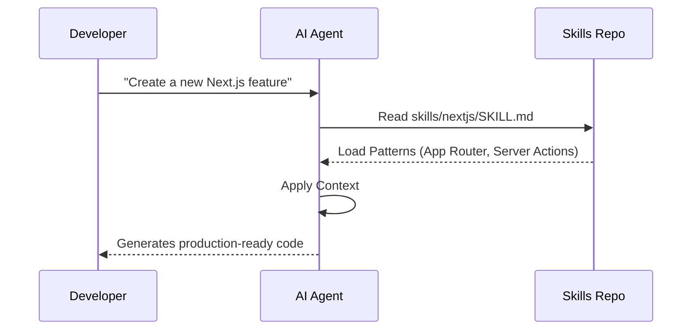

<div align="center">

# Skills as Context 🧠

**My Personal Collection of AI Agent Skills**

[](LICENSE)
[](https://agentskills.io)
[](#)

<p align="center">
  <a href="#-quick-start">Quick Start</a> •
  <a href="#-how-it-works">How It Works</a> •
  <a href="#-catalog">Catalog</a>
</p>

</div>

---

### ⚠️ About this repository

This is a **personal and opinionated collection of AI agent skills**, tailored to my own projects, workflows, and technical preferences.

- Skills may depend on conventions or utilities specific to my stack  
- Not intended as a generic or stable public catalog  
- Breaking changes may occur without notice  

👉 Looking for **reusable, public skills**?  
Check out **`agent-skills-labs`** (generic, installable skills).

---

## ⚡️ Why Skills?

This repository houses the **coding standards, architectural patterns, and best practices** adapted specifically for **my projects**. It serves as persistent memory for my AI assistants (Claude, Cursor, Antigravity), ensuring they always work the way I do.

| 🎯 **My Patterns** | ⚡️ **My Workflow** | 🛡️ **My Standards** |
| :--- | :--- | :--- |
| **No more quirks.** Agents use my exact preferred structure for Next.js and React. | **Zero friction.** I instantiate my standard features with single triggers. | **Consistency.** Every project adheres to my defined folder structures and naming conventions. |

---

## 🌊 How It Works



---

## 🚀 Quick Start

Transform your project in **30 seconds**. Run this command at your project root:

```bash
curl -sSL https://raw.githubusercontent.com/gpolanco/skills-as-context/main/templates/init-agent.sh | bash
```

**That's it.** You now have a `.agent/skills` (or `skills/`) folder populated with the standard catalog.

### Next Steps

1.  **Ask your AI**: `"Use @skill-integrator to configure this project."`
2.  **Verify**: Check that `AGENTS.md` has been created.
3.  **Code**: Start building with superpowers!

> "Create a form using @forms"
> "Refactor this component using @react-19"
> "Add a database table using @supabase"

---

## 📦 Catalog

### 🏗️ Meta-Skills (The Brains)

| Skill | Description | Trigger |
| :--- | :--- | :--- |
| [**skill-integrator**](skills/skill-integrator) | 🧠 **Context Awareness.** Analyzes your tech stack and auto-loads relevant skills. | `"Setup project"` |
| [**skill-creator**](skills/skill-creator) | 🏭 **Factory.** detailed guide to building your own high-quality skills. | `"Create a skill"` |

### 📚 Generic Skills (The Knowledge)

| Category | Skill | Description |
| :--- | :--- | :--- |
| **Core** | [**structuring-projects**](skills/structuring-projects) | Domain-Driven Design (DDD) & Feature-First architecture patterns. |
| | [**typescript**](skills/typescript) | Strict type safety, proper interfaces, and modern TS features. |
| **Frontend** | [**react-19**](skills/react-19) | React Compiler, Actions, and Server Components. |
| | [**tailwind-4**](skills/tailwind-4) | Utility-first styling with the new Tailwind v4 engine. |
| | [**forms**](skills/forms) | Type-safe forms with React Hook Form + Zod. |
| **Backend** | [**nextjs**](skills/nextjs) | App Router, Server Actions, Middleware, and Caching. |
| | [**supabase**](skills/supabase) | Row Level Security (RLS), Auth, and Database patterns. |
| **Quality** | [**zod-4**](skills/zod-4) | Runtime validation schemas. |
| | [**testing-vitest**](skills/testing-vitest) | Unit and integration testing strategies. |

👉 **[Browse Full Catalog](skills/README.md)**

---

<div align="center">
  <p>Standardized by <a href="https://agentskills.io">AgentSkills.io</a></p>
  <p><i>Empowering developers to build better, faster, and smarter.</i></p>
</div>
